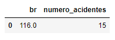
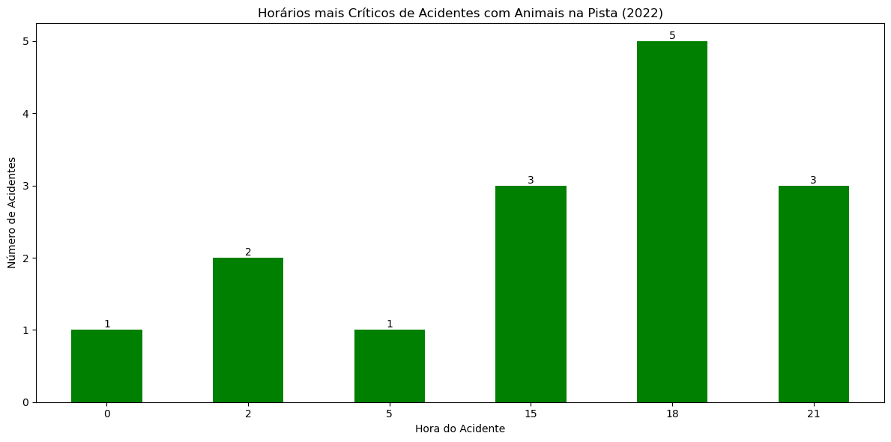
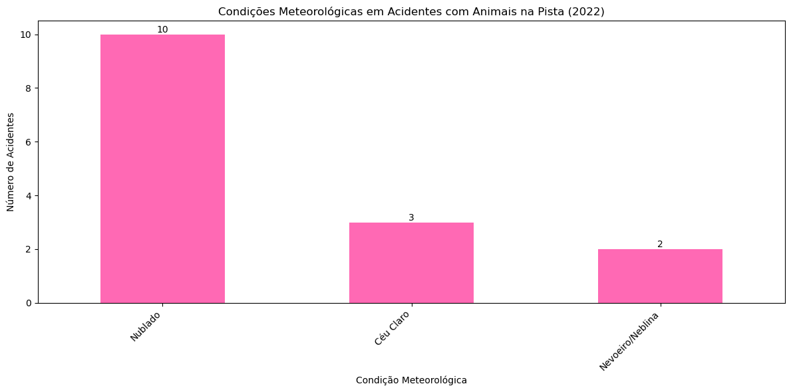
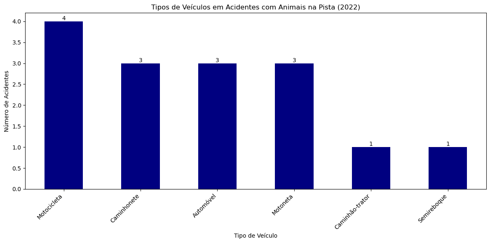
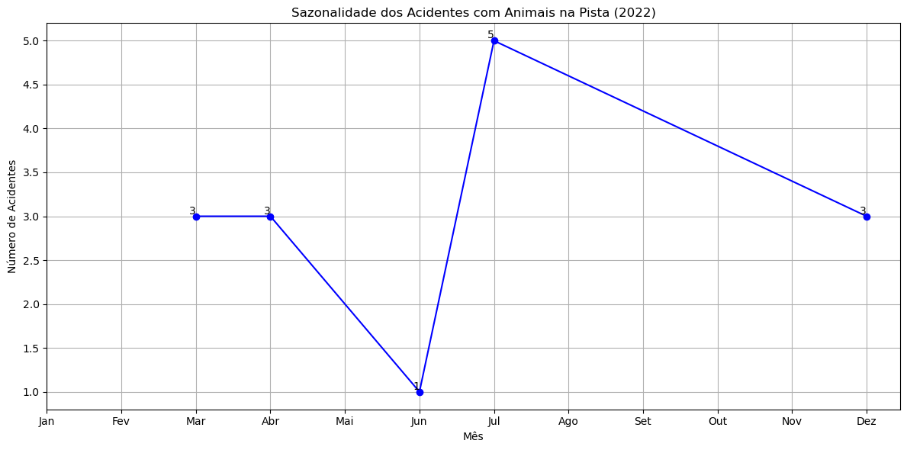
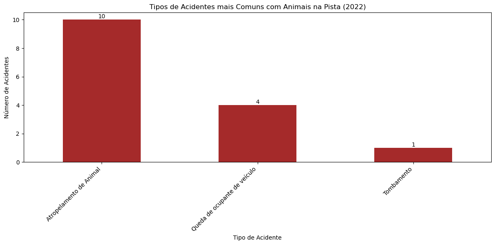
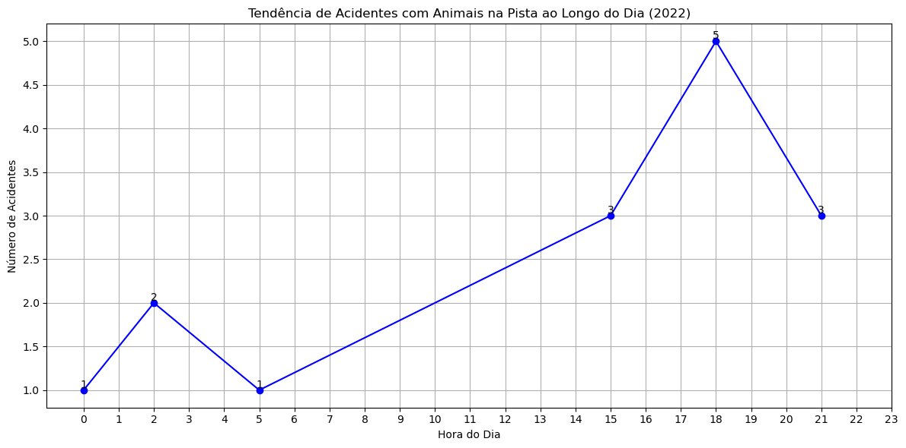
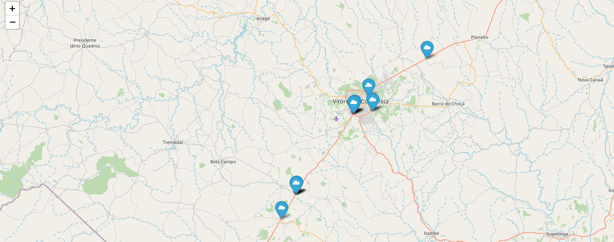
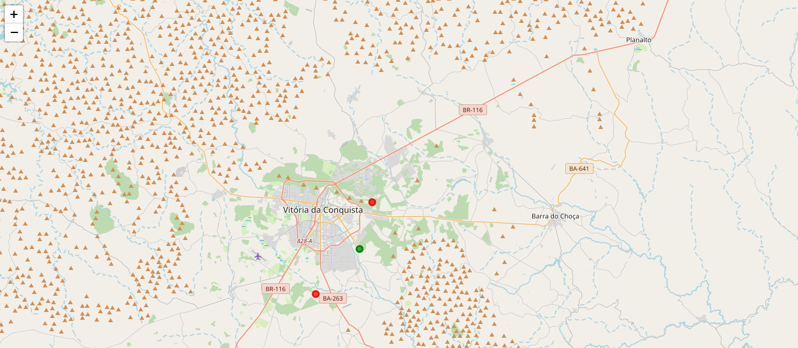
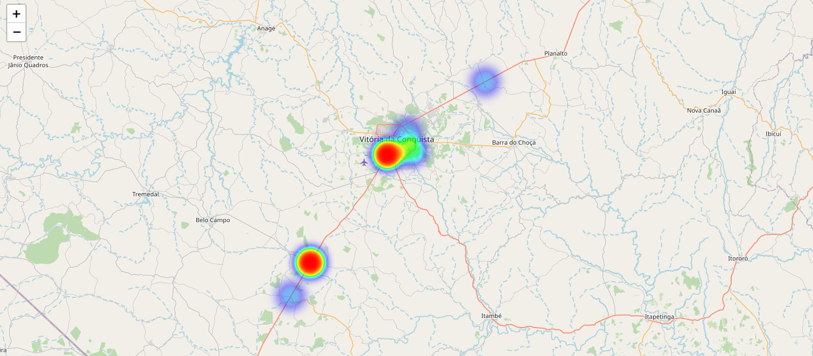

# Análise dos acidentes de trânsito ocasionados por animais nas rodovias federais do munícipio de Vitória da Conquista, Bahia, no ano de 2022

# 1. Introdução

Reduzir o número de acidentes de trânsito e suas consequências devastadoras nas rodovias brasileiras é um desafio complexo, mas é absolutamente essencial para a segurança pública e o bem-estar da sociedade. Isso porque, ano a ano vidas são perdidas em decorrência de acidentes no trânsito. E não é somente vida humana, mas também de animais que morrem atropelados. O Brasil historicamente teve um alto número de acidentes de trânsito. Em 2020, por exemplo, o país registrou mais de 155 mil acidentes com vítimas, resultando em cerca de 30 mil mortes. Vários fatores contribuem para acidentes de trânsito, incluindo excesso de velocidade, distração ao volante, imprudência, falta de manutenção adequada de veículos e infraestrutura rodoviária inadequada. Mas um fator importante que contribue para esses acidentes são os animais na pista, e é sobre isso que esse projeto se desbruça.

OBSERVAÇÃO: Caso não esteja conseguindo visualizar o arquivo do jupyter notebook aqui pelo Github, você pode acessar este link: (https://drive.google.com/file/d/1cq5jWZtAoxOErVdC9DPNbFjjEjA-iEK2/view?usp=sharing)

# 2. Objetivo

Análisar dados dos acidentes de trânsito ocasionados por animais nas rodovias federais do munícipio de Vitória da Conquista, Bahia, no ano de 2022, com a finalidade de entender as tendências e os padrões desses acidentes e obter insights.

# 3. Justificativa
   
A análise de dados relacionados a acidentes de trânsito é muito importante, pois permite entender as tendências e os padrões dos acidentes e obter insights, como por exemplo identificar trechos de estradas com alta probabilidades de acidentes e atropelamento de animais nas rodovias federais e, a partir disso, será possível oferecer soluções que possibilitam ações preventivas e uma gestão de frotas mais sustentável e eficiente, tornando as estradas mais seguras e ambientalmente sustentável e salvando vidas.

# 4. Metodologia
   
Este é um projeto de análise de dados, que envolve a utilização das bibliotecas do python com objetivo de encontrar tendências e padrões nos dados e gerar insights. Para alcançar o objetivo proposto, o primeiro passo é importar as bibliotecas necessárias para construção do projeto. Em seguida, é feita a coleta dos dados. Logo após, uma análise dos dados inicial, com intuito de conhecer os dados e verificar possíveis inconsistências, tais como valores faltantes, valores inconsistentes, valores duplicados, presença de outliets, dentre outros. Depois, é feito a limpeza e o tratamento dos dados. Em seguida é realizado análise exploratória dos dados, com a finalidade de obter insigts para o time de negócios.

# 5. Coleta de dados

Os dados foram extraidos da [Polícia Rodoviária Federal (PRF)](https://www.gov.br/prf/pt-br/acesso-a-informacao/dados-abertos/dados-abertos-acidentes) Foi feio o downloard do arquivo em csv e importado para o Databricks. Depois, filtrou-se os dados somente para o município de Vitória da Conquista/BA. Após isso, foi feito um cópia desses dados. Segue abaixo uma amostra da tabela. Para visualizar a tabela completa, acesse o arquivo por meio do link disponibilizado acima.

## 5.1 Amostra da tabela

## 5.2 Visualizando todas as colunas da tabela em um formato de lista

Com os dados importados para o Databricks, o primeiro passo foi verificar inconsistêcias nos dados. Observou-se que não havia valores duplicados, mas que algumas colunas não estavam com o tipo de dado correto. Além disso, percebeu-se que ascolunas pesid, marca, ano e idade possuiam 131, 99, 188 e 259 valores nulos, respectivamente. Após verificar as inconsistências, o foco foi a limpeza e tratamento desses dados. Optou-se por remover as colunas que continham valores nulos, uma vez elas não seriam utilizadas na análise. Com os dados tratados, a próxima etapa foi fazer a Análise Exploratória dos Dados com objetivo de obter insigts para o time de negócios.

# 6. Análise Exploratória dos Dados: Obtendo insigts para o time de negócios

Algumas perguntas as serem respondidas para o time de negócios:

**1**. Qual o número de acidentes envolvendo animais na pista nas rodovias federais de Vitória da Conquista em 2022?

**2.** Quais horários mais críticos que ocorreram acidentes envolvendo animais na pista nas rodovias federais de Vitória da Conquista em 2022?

**3.** Quais as condições meterológicas em que esses acidentes ocorreram?

**4.** Quais são os tipos de veículos mais frequentemente envolvidos em acidentes com "Animais na Pista"?

**5.** Existe uma sazonalidade nos acidentes com "Animais na Pista"? Isso varia ao longo do ano?

**6.** Qual é o tipo de acidente mais comum quando envolve "Animais na Pista"?

**7.** Existe uma tendência ao longo do dia para acidentes com "Animais na Pista"?

**8.** Quais os trechos na Br 116 em que esses acidentes ocorreram?

**9.** Com base nas informações fornecidas pela base de dados da Polícia Rodoviária Federal (PRF), crie um mapa que mostre as áreas com maior probabilidade de encontros com animais selvagens, supondo probabilidades de  [0.7, 0.4, 0.9], já que essa informação não é possível ser calculada levando-se em consideração os dados da base de dados fornecida.

**10.** Com nas informações fornecidas pela base de dados da Polícia Rodoviária Federal (PRF), crie um mapa de risco que identifique áreas críticas para atropelamentos de "Animais na Pista".

## 1.Qual o número de acidentes envolvendo animais na pista nas rodovias federais de Vitória da Conquista em 2022?

* Foram 15 acidentes envolvendo animais na pista na Br-116.
## 2. Quais horários mais críticos que ocorreram acidentes envolvendo animais na pista nas rodovias federais de Vitória da Conquista em 2022?

* Os horários mais críticos em que esses acidentes ocorreram foram 15h, 18h e 21h.
## 3. Quais as condições meterológicas em que esses acidentes ocorreram?

* A maioria dos acidentes ocorreram quando o tempo estava nublado.
## 4. Quais são os tipos de veículos mais frequentemente envolvidos em acidentes com "Animais na Pista"?

* Os tipos de veiculos mais frequentes envolvendo animais na pista na Br-116 oram motocicleta, caminhonete, automóvel e mononeta.
## 5. Existe uma sazonalidade nos acidentes com "Animais na Pista"? Isso varia ao longo do ano?

* A maioria dos acidentes ocorram no mês de julho.
## 6. Qual é o tipo de acidente mais comum quando envolve "Animais na Pista"?

* O tipo mais comum de acidentes envolvendo animais na pista é o atropelamento de animais.
## 7. Existe uma tendência ao longo do dia para acidentes com "Animais na Pista"?

* A maioria dos acidentes aconteceram as 18h.
## 8. Quais os trechos na Br-116 em que esses acidentes ocorreram?

* Pelo mapa, tendo em vista a latitude e longitude, é possível observar que dois acidentes envolvendo animais na pista ocorreram no Km 827,4, três no KM 827,8, um no KM 28, dois no KM 20,8, um no KM 805, um no Km 869, 3 no KM 860 e por ai vai.

Visualize este mapa pelo link: (https://drive.google.com/file/d/1cq5jWZtAoxOErVdC9DPNbFjjEjA-iEK2/view?usp=sharing)

## 9. Com base nas informações fornecidas pela base de dados da Polícia Rodoviária Federal (PRF), crie um mapa que mostre as áreas com maior probabilidade de encontros com animais selvagens, supondo probabilidades de [0.7, 0.4, 0.9], já que essa informação não é possível ser calculada levando-se em consideração os dados da base de dados fornecida.

* Os pontos em vermelhos no mapa representam as áreas de riscos, baseado na probabilidade fornecida.

Visualize este mapa pelo link: (https://drive.google.com/file/d/1cq5jWZtAoxOErVdC9DPNbFjjEjA-iEK2/view?usp=sharing)
  
## 10. Com nas informações fornecidas pela base de dados da Polícia Rodoviária Federal (PRF), crie um mapa de risco que identifique áreas críticas para atropelamentos de "Animais na Pista".

 Visualize este mapa pelo link: (file:///C:/Users/mauri/OneDrive/Documentos/GitHub/Analisando-acidentes-de-transito-envolvendo-animais-em-VCA/mapa_areas_criticas.html)

 # 7. Conclusões
 * No ano de 2022 foram 15 acidentes envolvendo animais nas rodovias federais de Vitória da Conquista.

* Os horários mais críticos em que esses acidentes ocorreram foram as 15h, 18h e 21h.

* A maioria dos acidentes envolvendo animais ocorreram quando o tempo estava nublado.

* Os tipos de veículos mais frequentemente envolvidos em acidentes com animais na pista foram motocicletas, caminhonete, automóvel e motoneta.

* A maioria dos acidentes ocorreram no mês de julho.

* O tipo de acidente mais comum quando envolve animais na pista é o atropelamento de animal.

* A maioria dos acidentes acoteceram as 18h.

* Pelo mapa, tendo em vista a latitude e longitude, é possível observar que dois acidentes envolvendo animais na pista ocorreram no Km 827,4, três no KM 827,8, um no KM 28, dois no KM 20,8, um no KM 805, um no Km 869, 3 no KM 860 e por ai vai.

* Os dois últimos mapas mostram, respectivamente, as áreas com maior probabilidade de encontros com animais selvagens com base na probabilidade fornecida e as áreas críticas para atropelamentos de animais na pista.
